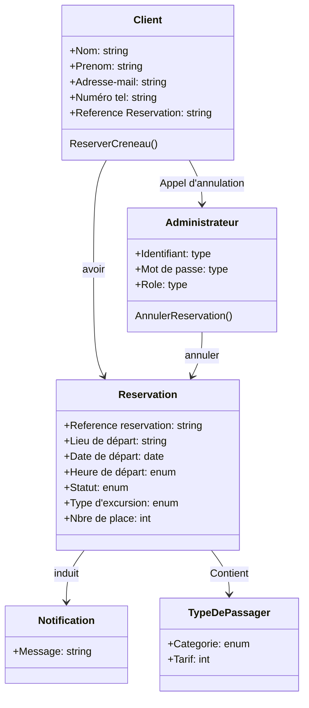

# Diagramme de classes : Annulation

## Classes

### Client
- **Attributs**
  - + Nom : string
  - + Prenom : string
  - + Adresse-mail : string
  - + Numéro tel : string
  - + Reference Reservation : string
- **Méthodes**
  - ReserverCreneau()

### Administrateur
- **Attributs**
  - + Identifiant : type
  - + Mot de passe : type
  - + Role : type
- **Méthodes**
  - AnnulerReservation()

### Reservation
- **Attributs**
  - + Reference reservation : string
  - + Lieu de départ : string
  - + Date de départ : date
  - + Heure de départ : enum
  - + Statut : enum
  - + Type d'excursion : enum
  - + Nbre de place : int

### Type de passager
- **Attributs**
  - + Categorie : enum
  - + Tarif : int

### Notification
- **Attributs**
  - + Message : string

## Relations
- **Client** → **Administrateur** : *Appel d'annulation*
- **Client** → **Reservation** : *avoir*
- **Administrateur** → **Reservation** : *annuler*
- **Reservation** → **Notification** : *induit*
- **Reservation** → **Type de passager** : *Contient*

## Version Mermaid

